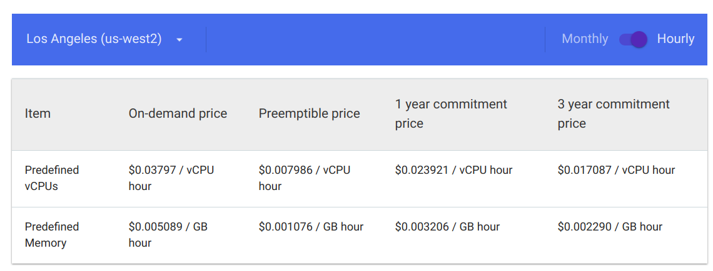
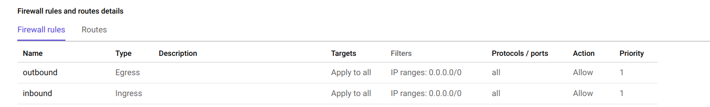

# Hosting a v2ray proxy on GCP VM instance free tier

Most cloud service giants these days offers some free tier functionality for those of us who just want to have a taste of it. Or simply learn some new tricks. Here is a step by step sample setting up a v2ray proxy service on Google Cloud Computing VM instance. Please referring to https://cloud.google.com/compute/pricing for how google charge you. For learning purposes, $300 credit is good enough. However if you want to use proxy all the time, there are more economical options out there.



-------------------------------------------------------------------------------------------------------------------
### Steps start here

1. Go to Compute Engine in GCP console, select VM instance, click [create an instance]. Choose any location you want, an OS you're familiar with and since the proxy service does not need much computing power, the micro CPU 0.6G is good enough.

2. Once the instance is created, write Firewall Rules for inbound and outbound traffic. The easiest setting: allow all protocol and allow all ports. ( CIDR notation for all ip is: 0.0.0.0/0 ) For priority setting, give both inbound and outbound a priorty of 1, that is the highest.



3. Once the firewall is properly setup, we're down with google's setting. Now, SSH to your newly greated instance terminal.

4. I'm running Ubuntu 18.04 OS, so I ran: sudo apt update for update. Run the equivalent command with your OS.

5. v2ray service is time sensitive. Before installing, run command: date -R to check is time is accurate. If time is off more than +- 2 minutes, use: date -set command to reset time. (Time zone does not have to be same)

6. According to https://toutyrater.github.io/prep/install.html, run: wget https://install.direct/go.sh;
Once the download is complete, run the go.sh script: sudo bash go.sh(if no error prompt, you're down with installing v2ray, surprisingly easy right? Your configuration file is in /etc/v2ray/config.json )

7. Here are commands for start, stop, restart, checking status v2ray:

  ```
  sudo systemctl start v2ray // start service
  sudo systemctl stop v2ray //stop service
  sudo systemctl restart v2ray // restart after configuration changes
  systemctl status v2ray //checking status of v2ray

  ```

8. Adjust your configuration as you like it. Here is a online config.json generator: https://intmainreturn0.com/v2ray-config-gen/.

9. And That's all for your server side v2ray set up.

  * Android client: v2rayNG
  * Linux client: use the same go.sh script as above
  * Windows: refer to https://github.com/v2ray/v2ray-core/releases
  * Apple client: Potatso Lite, shadowrocket, etc.
  
